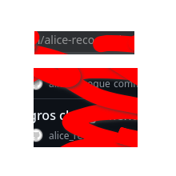
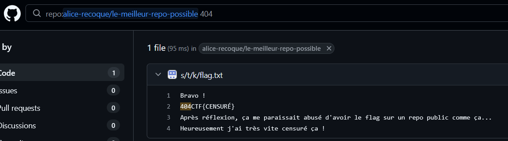
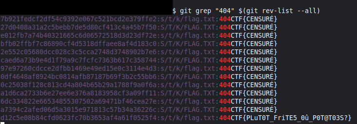

# C'était caché
> 100
> 
> easy
> 
> RaptorJésus
> 
> Une très grande dame française de l'informatique est en possession d'un flag, égaré sur une plateforme bien connue. À vous de réussir à le retrouver ! Format : 404CTF{leflag}

Cette image est fournie par le chall :


En regardant des endroits précis dans l'image, on arrive à reconstituer un pseudo.



Il s'agit d'une référence à Alice Recoque.

https://github.com/alice-recoque

Il n'y a qu'un seul repo contenant un grand nombre de dossiers/sous-dossiers et fichiers. Si je cherche "404CTF" dedans, je retrouve un fichier flag.txt qui a été censuré.

https://github.com/alice-recoque/le-meilleur-repo-possible



```
Bravo ! 
404CTF{CENSURÉ}
Après réflexion, ça me paraissait abusé d'avoir le flag sur un repo public comme ça...
Heureusement j'ai très vite censuré ça !

```

Le flag était visible dans un premier commit, puis il a été censuré et déplacé à de nombreuses reprises. Il faut alors regarder les commits, les fichiers qui ont changé.

Je clone le repo et je cherche sur internet comment chercher un bout de texte particulier dans les commits git. Je tombe sur ceci:

https://stackoverflow.com/questions/2928584/how-to-grep-search-through-committed-code-in-the-git-history


> To search for commit content (i.e., actual lines of source, as opposed to commit messages and the like), you need to do:

```
git grep <regexp> $(git rev-list --all)
```

Je me base donc sur ça pour trouver toutes les mentions de 404CTF.

```
git grep "404" $(git rev-list --all)
```



``404CTF{PLuT0T_FriTE5_0û_P0T@T03S?}``

