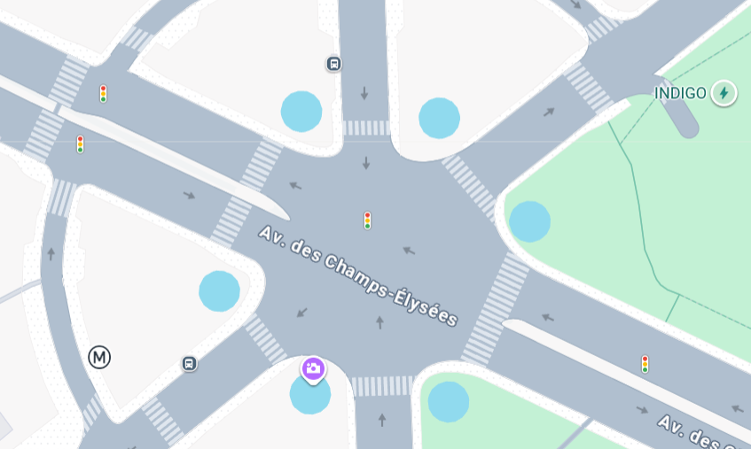
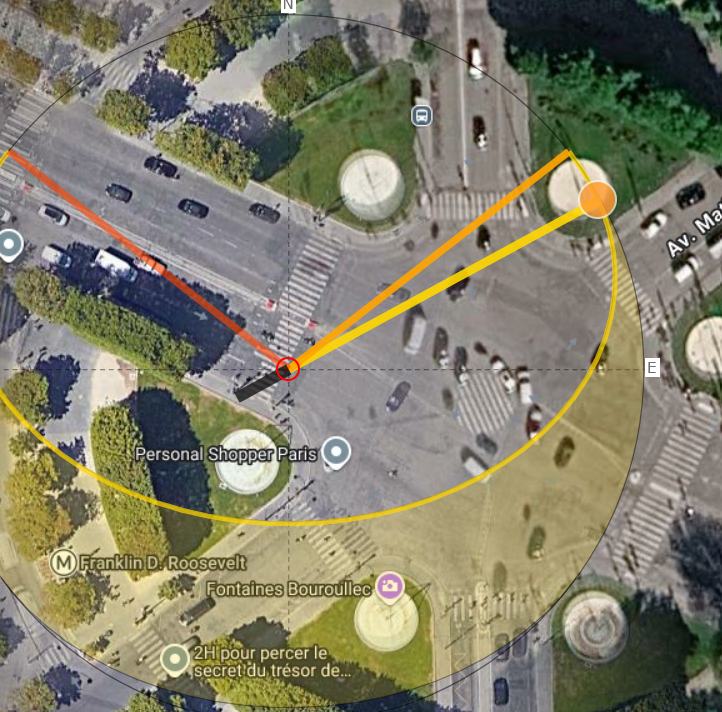

# Canular Savant

## Canular savant (1/3)
> 100
> 
> easy
> 
> Écrit par Sherpearce et Clarisse
> 
> Je (1.85m) me baladais à Paris, jusqu'à me retrouver à un rond-point bordé de plusieurs fontaines.
> 
> De quel rond-point s'agissait-il ?
> 
> Format du flag : 404CTF{carrefour-etoile_du_porte-avion-charles-de-gaulle}
> 
> Les flags de cette série ne comportent pas d'accents

Je cherche "rond point bordé de plusieurs fontaines paris" et je tombe sur des articles/pages mentionnant le rond-point des champs élysées.

https://www.paris.fr/pages/les-nouvelles-fontaines-des-champs-elysees-6563

Sauf que ``rond-point_des_champs_elysees`` ne fonctionne pas, il faut être plus précis.

https://fr.wikipedia.org/wiki/Rond-point_des_Champs-%C3%89lys%C3%A9es-Marcel-Dassault

``404CTF{rond-point_des_champs-elysees-marcel-dassault}``

## Canular savant (2/3)

> 100
> 
> medium
> 
> Écrit par Sherpearce et Clarisse
> 
> J’allais vers le nord, et alors que j’attendais que le feu passe au vert, je me suis rendu compte que j’écoutais un titre d’un célèbre groupe de musique alternative originaire de Columbus. J’ai été surpris d’entendre le nom d’un groupe de scientifiques français dans les paroles : de qui s’agissait-il ?
> 
> Format du flag : 404CTF{marie-curie}
> 
> (404CTF{curie} accepté également)
> 
> Les flags de cette série ne comportent pas d'accents

Si on cherche "groupe de musique alternative originaire de Columbus", on obtient direct les *Twenty One Pilots*. 

Je cherche s'il y a un lien entre un groupe de mathématicien francais et Twenty one pilots

Quelque chose du style "Twenty one pilots groupe de mathématicien français" sur google.

Le groupe de mathématicien **Nicolas Bourbaki** a été mentionné par une de leurs musiques.

https://fr.wikipedia.org/wiki/Nicolas_Bourbaki#Dans_la_culture_populaire

``404CTF{Nicolas_Bourbaki}``

## Canular savant (3/3)

> 100
> 
> insane
> 
> Écrit par Sherpearce
> 
> J'ai des souvenirs très précis de cette promenade. Alors que je me trouvais au centre du passage piéton, j'ai tourné la tête et vu une scène magnifique... mais j'ai oublié de prendre une photo ! Le soleil était comme posé sur le feu de signalisation diamétralement opposé à moi... j'y retournerais bien pour prendre une photo ! Par contre, malgré tout ces souvenirs, la seule chose dont je me souviens est que, quelques jours avant, environ une semaine je crois, c'était l'anniversaire d'un des anciens membres du groupe de scientifiques que j'ai mentionné précédemment. Si seulement je pouvais me souvenir de quel membre il s'agissait, il me semble qu'il n'est aujourd'hui plus de ce monde... Pensez-vous pouvoir m'aider ?
> 
> Format du flag : 404CTF{marie-curie}
> 
> Les flags de cette série ne comportent pas d'accents

J'ai gardé ce chall pour la fin étant donné qu'il n'y avait que 2/3 tentatives.

J'ai vu qu'il y avait un nombre étrangement élevé de solves pour un chall "Insane", jugé plus dur que Jean Quête

Le protagoniste était sur un des passages piétons et se dirigeait au nord.

Sur google maps, on peut voir plusieurs feux de signalisation

L'idée était peut-être de trouver le moment où le soleil se couchait sur le feu de signalisation "diamétralement opposé" avec suncalc. Avec le seul jour qui correspond à la position, il aurait fallu chercher tous les mathématiciens décédés qui étaient nés vers cette date.

(la photo n'est pas représentative mais il s'agissait peut-être de ce passage piéton)

J'ai aussi regardé s'il y avait des levers ou couchers de soleil spécifiques liés à l'arc de triomphe : 

https://saf-astronomie.fr/soleil-couchant-paris/

> Deux fois par an (en mai et en août), le Soleil se couche dans l’axe de l’Arc de Triomphe à Paris.

Mais les champs élysées seraient plus au nord ouest

Même si c'est probablement une mauvaise piste, je note tous les mathématiciens nés en mai ou en août.

Cependant le nombre de solves semble louche. 
- soit il y a eu de la triche massive sur ce chall (?)
- soit la solution était plus facile que prévue ?

Je retourne sur la partie "Twenty-One Pilots" sur Nicolas Bourbaki

> L'un d'eux, l'antagoniste principal, est nommé "Nico", abréviation de Nicolas Bourbaki. Un autre des évêques est nommé André, qui pourrait être une référence à André Weil

J'avais oublié que la partie "Les flags de cette série ne comportent pas d'accents" était présent sur tous les challs de la catégorie, donc je me suis dit qu'il fallait peut-être regarder un mathématicien avec des accents.

J'ai testé André Weil au hasard vu que j'avais encore deux essais mais c'était la bonne réponse.

``404CTF{andre-weil}``