# Jean Quête

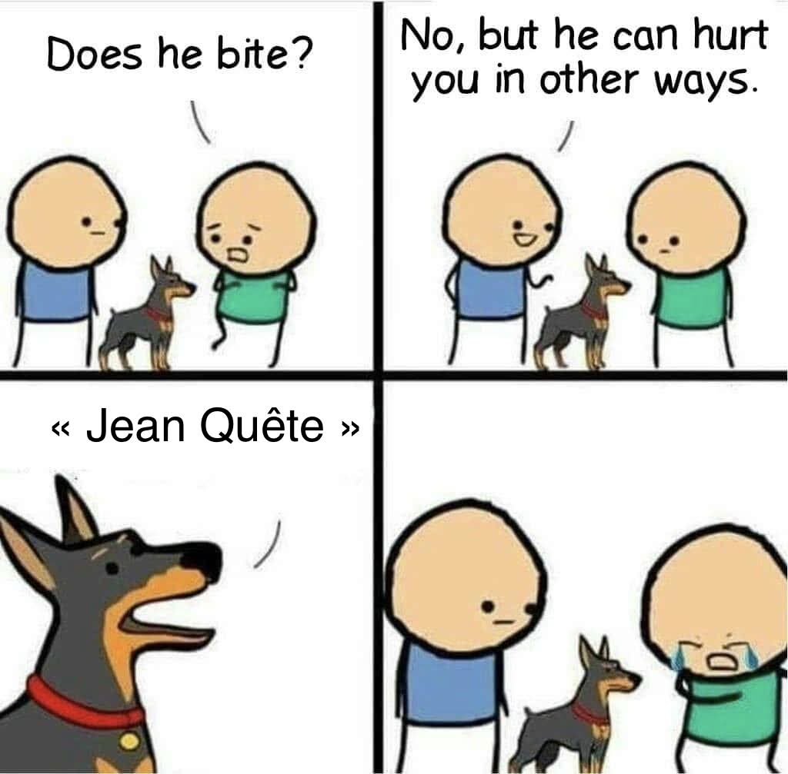

> 479
> hard
> 
> RaptorJésus
> 
> Si vous consultez les followers du compte instagram "Institut du cerveau", vous devriez trouver un compte avec un nom un peu particulier, un certain Jean quelque chose... Pourrez vous trouver dans quelle ville habite son frère ?
> 
> Format : 404CTF{blancherive_la_belle_et_l_unique}

## Le début

Sur Instagram, on recherche les followers de l'Institut du Cerveau et on cherche des "Jean". Normalement, un compte devrait attirer notre attention.

En effet, on tombe sur un Jean quatrecentctf bien intéressant.


Il n'y a pas grand-chose sur son compte, les images qu'il utilise sur ses posts sont des images libres de droit, mais ça va nous permettre de pivoter.
https://www.instagram.com/jean_quatrecentctf/

Si on recherche "Jean Quatrecentctf", on tombe très rapidement sur son compte facebook. En regardant son profil, on sait que c'est un fan de restaurants.

https://www.facebook.com/people/Jean-Quatrecentctf/61577353321253/

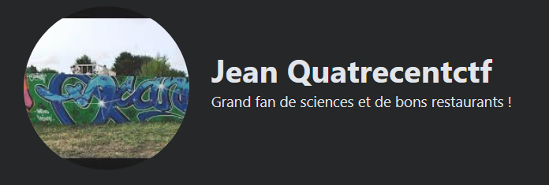

Il a fait un post où il mentionne son frère 
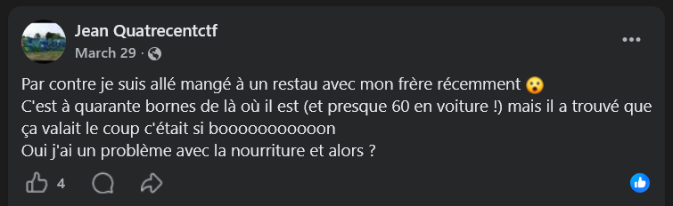

```
Par contre je suis allé mangé à un restau avec mon frère récemment 😮
C'est à quarante bornes de là où il est (et presque 60 en voiture !) mais il a trouvé que ça valait le coup c'était si booooooooooon 
Oui j'ai un problème avec la nourriture et alors ?
```

Il a également posté quelque chose sur son "centième avis" sur google maps.

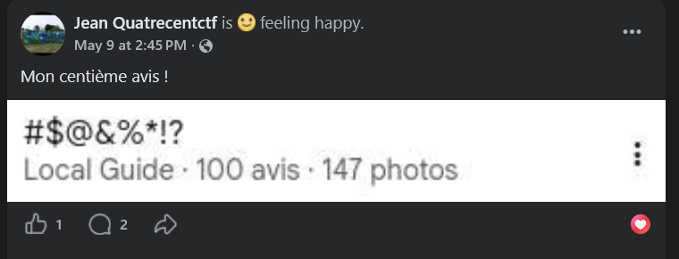

```Mon centième avis !```

En réalité Jean n'a pas posté 100 avis et 147 photos, mais on peut en déduire que Jean a posté au moins un avis sur Google maps quelque part. A partir du profil du personnage, on peut supposer qu'il a laissé des avis Google sur des restaurants.

Deux autres posts mentionnent qu'il est parti en vacances. Il y a une photo sur une résidence de vacances et une autre sur une grotte.

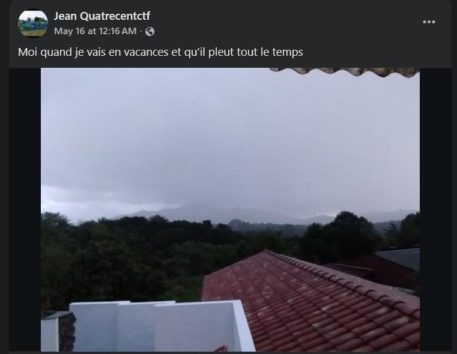

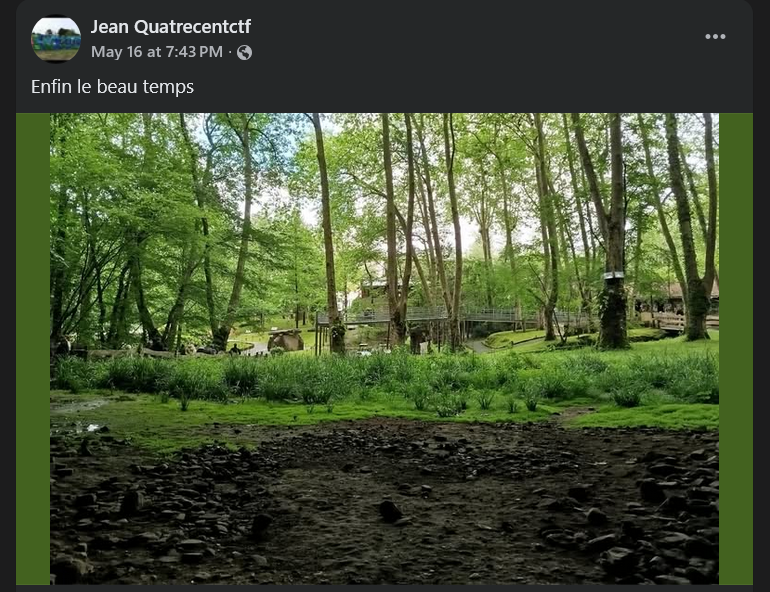

Parmi toutes les photos qui ont été postés sur le compte, seules 3 n'ont pas l'air d'être des photos libres de droit.

- Les deux photos de vacances
- Sa photo de profil avec un graffiti

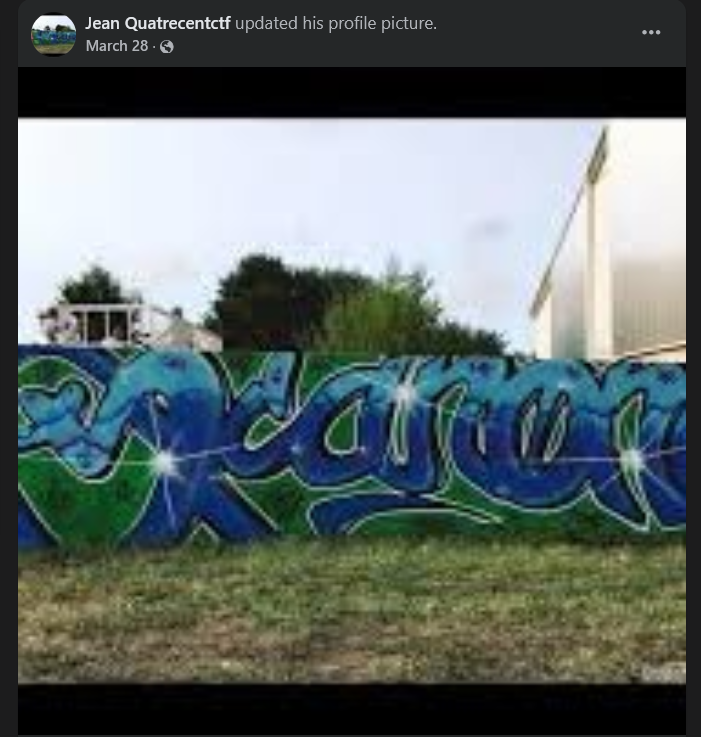

## Les problèmes

Ma première idée était alors de chercher où ont été prises les photos de vacances. Même s'il a pris des vacances après le repas avec son frère, il aurait été possible de rebondir. Le chemin hypothétique serait le suivant : 
1. Endroit localisé
2. Jean laisse un avis sur un restaurant aux alentours, on peut le retrouver sur google maps (16 mai environ)
3. A partir de son compte, on peut regarder s'il a posté d'autres avis, dont un vers le 28 mars qui mentionne son frère
4. Regarder toutes les villes où ville => restaurant fait environ 60km en voiture.

J'ai réussi à retrouver l'endroit de la 2e photo, il s'agit des grottes de Sare.

https://nl.wikiloc.com/routes-wandelen/camino-del-baztan-bera-zugarramurdi-134929643#wp-134929654

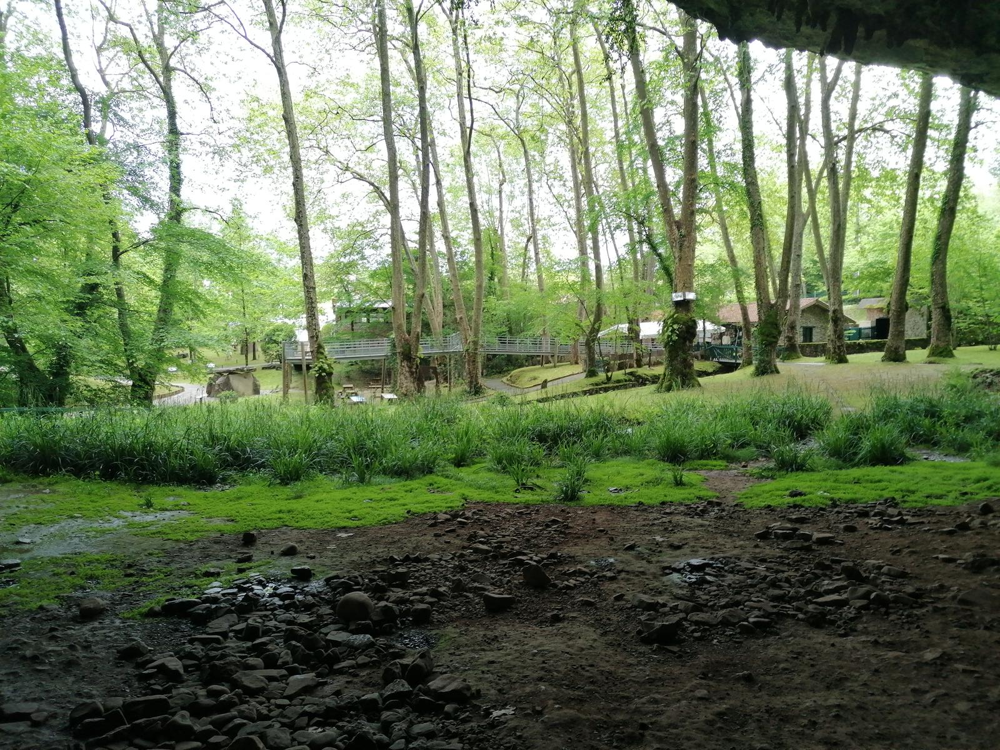

A partir de cet endroit, j'essaie alors de regarder les avis des restaurants aux alentours datant de mars 2026 max (le compte Facebook pour le chall a été créé le 25 mars 2026), pour voir si un Jean quatrecentctf a posté quelque chose, sans succès.

J'essaie ensuite de regarder les résidences qui correspondent à la première photo, vue sur un sommet/montagne (La Rhune ?), proche d'un bois ou d'une forêt. J'ai aussi regardé les chambres d'hôtes, les hotels, les gîtes, mais toujours rien.

Je décide d'abandonner Sare et de regarder du côté du graffiti.

Avec un recherche par images inversée, on découvre rapidement qu'il a été fait par un certain ScanOne

https://www.facebook.com/photo/?fbid=2227904043951248&set=pb.100064013529825.-2207520000

Sur [son site](images/https://www.scanonegraffiti.com/scanone), on trouve une photo de meilleure qualité.

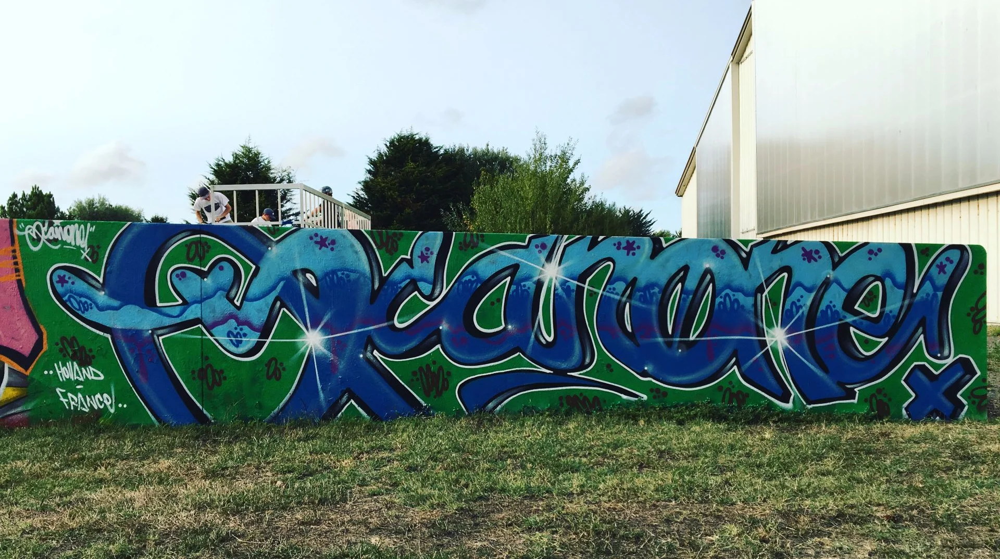

Dans les deux cas, il mentionne la France, mais on ne sait pas où précisément.

Cependant sur son compte Instagram, une photo du même graffiti mentionne la ville dans les hashtags !

https://www.instagram.com/p/Ci8feR7rsOs/

```
#ScanOne #graffiti #art #sainthilairederiez #france
From 🇸🇱 to 🇫🇷 #passion #colors #letterart #streetart #tags #spraycans @montanacans @montana_colors 🎨✨
scanonegraffiti.com
```

Il s'agit de Saint-Hilaire-de-Riez.

Sur Legal Walls (site qui référence tous les endroits où les graffitis sont autorisés), il y a un seul endroit à Saint-Hilaire.

https://www.legal-walls.net/wall/1004


https://maps.google.com/maps?q=46.709927,-1.960479&ll=46.709927,-1.960479&z=18

Sur street view, on voit bien le bâtiment à droite

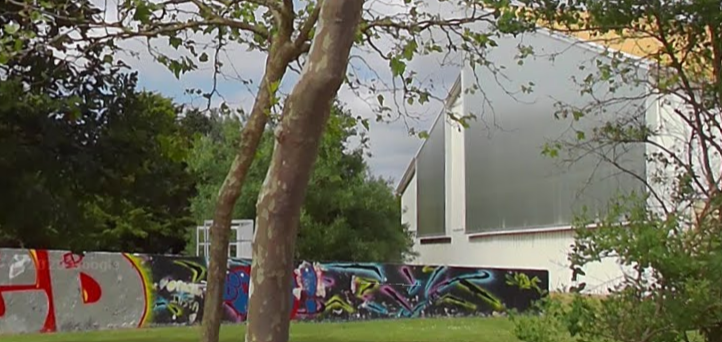

A partir de cet endroit, je regarde les avis de tous les restaurants aux alentours. Et là miracle !

https://maps.app.goo.gl/o5QMt5yu6US1Sggg8

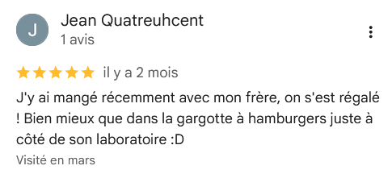

```
J'y ai mangé récemment avec mon frère, on s'est régalé ! Bien mieux que dans la gargotte à hamburgers juste à côté de son laboratoire :D
```

Sur Google maps, je regarde alors toutes les villes ayant un nom assez long à 60km environ du restaurant.

Après avoir testé différentes villes à 60km environ, Noirmoutier-en-l'Ile est la bonne réponse.

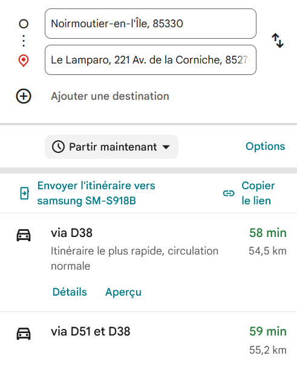

A posteriori, on pouvait regarder s'il y avait des laboratoires proches d'un restaurant proposant des burgers ou des fast-food. 
C'est le cas à Noirmoutier-en-l'Ile, où il y a un Laboratoire d'analyses médicales et La Balise qui vend des burgers juste à côté.

https://maps.app.goo.gl/8HLCZYeP17uCa8an7

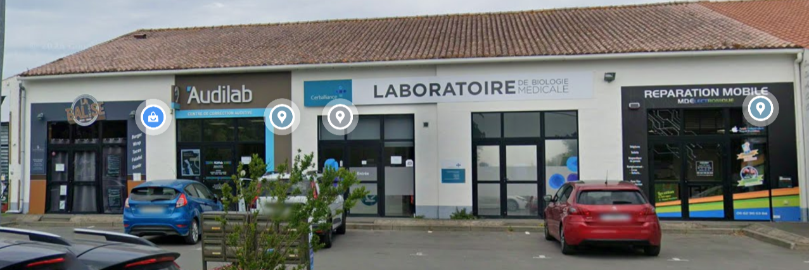


Flag : ``404CTF{noirmoutier_en_l_ile}``
