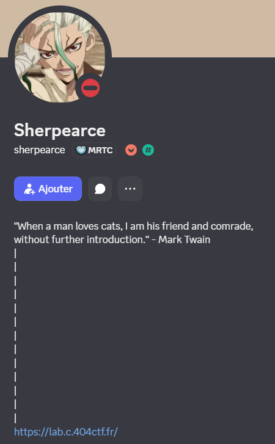
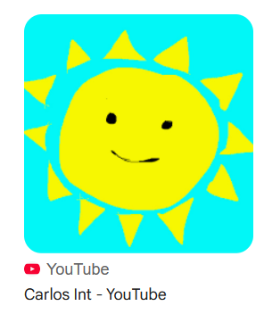
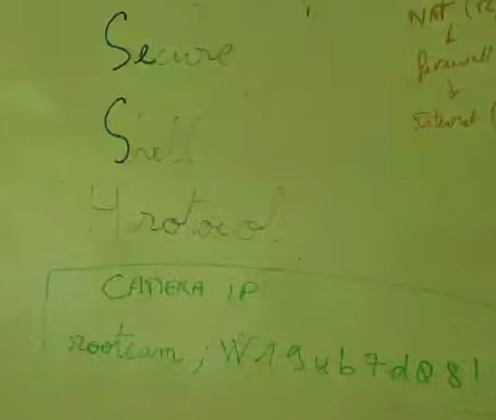
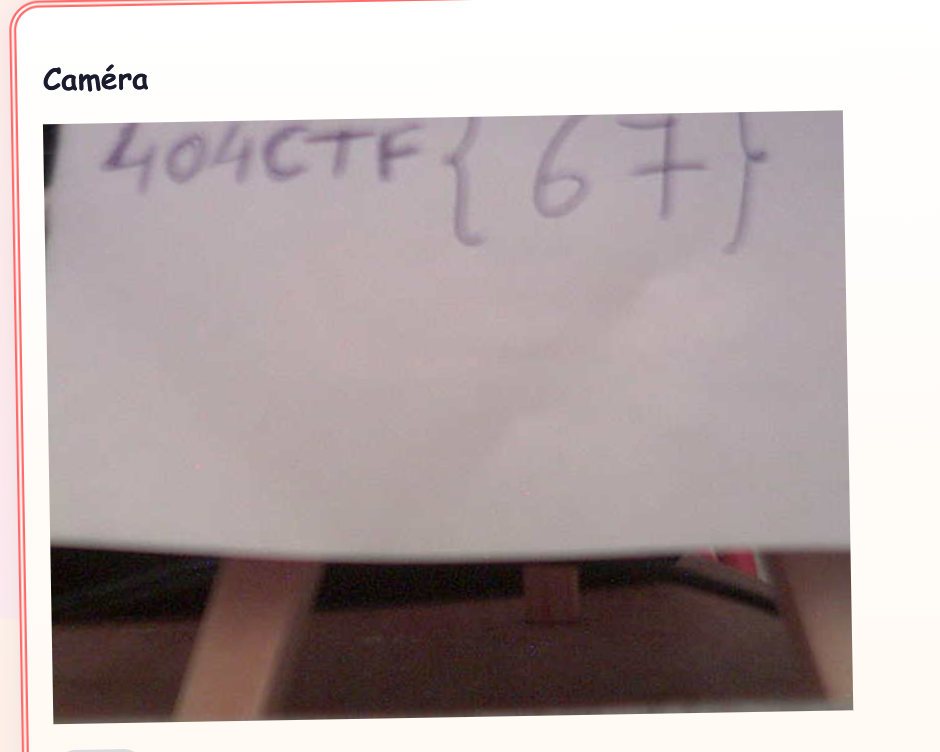
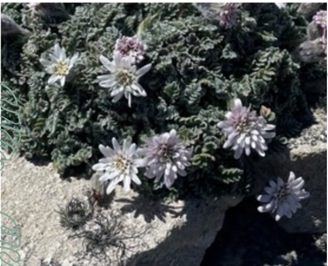
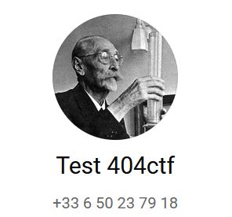

# Monsieur C

## Monsieur C : Découverte
> 100
> 
> intro
> 
> Écrit par Sherpearce
> 
> Un étrange personnage se présentant comme "Monsieur C" est venu me voir, moi, créateur du chall, en DM pour faire de la pub pour son nouveau blog en partageant son URL. Il était si sympathique que je n'ai pu refuser et ai mis son URL dans le premier endroit que j'avais sous les yeux. Quel est l'URL du blog ?
> 
> Format du flag : `404CTF{blog.404ctf.fr}`
> 
> "Monsieur C" n'est pas un pseudo à investiguer, il s'agit seulement d'un alias destiné à cacher la véritable identité de Monsieur C ;)


Il faut regarder le compte de Sherpearce sur Discord. Dans sa bio, il y a un lien vers un blog.



Flag : ``404CTF{https://lab.c.404ctf.fr}``


## Monsieur C : Somebody is watching me

> Monsieur C : Somebody Is Watching Me
> 
> 100
> 
> medium
> 
> Écrit par Sherpearce et Clarisse
> 
> L'individu surveillé cache probablement des informations d'importance capitale chez lui. D'après nos renseignements, il dispose d'un dispositif de surveillance à son domicile. Encore faut-il trouver un moyen d'y accéder...

On reprend le lien du blog.

https://lab.c.404ctf.fr/

Il y a trois pages : 

- `blog` la page principale où Monsieur C a posté plusieurs messages.
- `cv` le CV de Monsieur C
- `/login` une page où il y a besoin d'identifiants. (username/password)

Dans le blog, on sait que Monsieur C a créé une chaine youtube.

```
J’ai créé ma chaîne YouTube 🎥
4/16/2026, 6:10:00 PM

Ça y est, je me suis lancée : j’ai créé une chaîne YouTube ! Je vais y partager des vidéos très simples : coulisses de dessins, tests de matériel, et petites discussions sur la créativité. J’ai un peu le trac, mais je suis super content.
```

Lorsqu'on regarde son CV, on voit une photo de profil et son nom "Carlos Int".


En faisant une recherche par image inversée sur sa photo de profil, on retrouve très rapidement sa chaîne youtube.



https://www.youtube.com/@IntCarlos

Dans cette chaîne, Carlos a posté plusieurs vidéos et shorts.

Un short va nous intéresser tout particulièrement, celui où il présente sa chambre.

https://www.youtube.com/shorts/cR_RMPZ6QF8

Des identifiants sont visibles sur un tableau.



``rootcam:W19ub7d08!``

Il n'y a pas besoin de se connecter à SSH. On entre les identifiants sur la page de login (https://lab.c.404ctf.fr/login) et ça marche.



Flag : `404CTF{67}`


## Monsieur C : Voyage voyage

> 100
> 
> medium
> 
> Écrit par Clarisse et Sherpearce
> 
> Monsieur C est récemment parti en vacances. Il y a quelques siècles, un explorateur français s'était lui aussi rendu pour la première fois sur ce lieu, accompagné d'un naturaliste. Comment s'appelle ce naturaliste ?
> 
> Format du flag : 404CTF{jean-jean_quete}

On repart de la chaine youtube.

Carlos a posté des souvenirs de voyage.

https://youtu.be/Y-mu1x0LMZs

Il a rencontré des personnes mais il a aussi pris des photos.




En faisant une recherche par images, on découvre qu'il s'agit d'une Leucheria suaveolens (et non Leucheria leontopodioides). Les Leucheria sont originaires d'Amérique du Sud et des Îles Falkland (Iles Malouines).

https://identify.plantnet.org/the-plant-list/species/Leucheria%20leontopodioides%20(Kuntze)%20K.Schum./data

https://en.wikipedia.org/wiki/Leucheria

En cherchant à nouveau sur Wikipedia, on se rend compte que Bougainville (explorateur français) s'était rendu sur les Îles il y a quelques siècles.

https://fr.wikipedia.org/wiki/Louis-Antoine_de_Bougainville

> Il est accompagné pour ce voyage d'Antoine-Joseph Pernety qui officie en tant qu’aumônier et naturaliste.

Flag : ``404CTF{antoine-joseph_pernety}``

## Monsieur C : Fan de sciences
> 430
> 
> hard
> 
> Écrit par Clarisse et Sherpearce
> 
> Qui est le scientifique préféré de "Monsieur C" ?
> 
> Format du flag : 404CTF{jean_quete}


Carlos a répondu à un quiz sur les scientifiques mais il n'y a rien d'évident.

https://www.youtube.com/shorts/V7ioKOQSaa8


En fait, il faut retourner sur le CV. Carlos Int a indiqué un numéro de téléphone.


On teste alors le numéro de téléphone sur Telegram, Whatsapp, etc. pour voir s'il a un compte. 

En effet, il a bien un compte whatsapp avec une photo de profil de scientifique.



Il s'agit de Camille Guérin. 

``404CTF{camille_guerin}``

