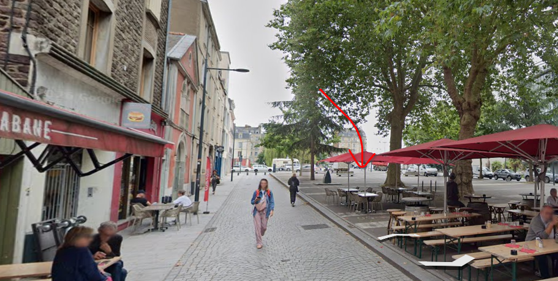
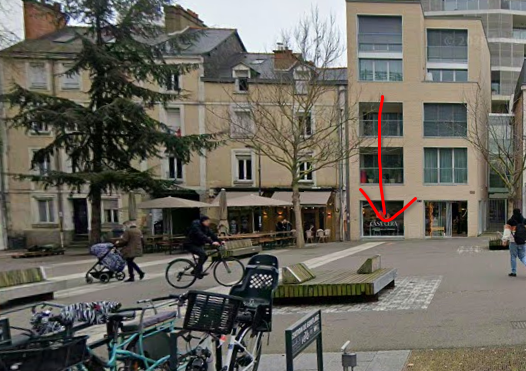
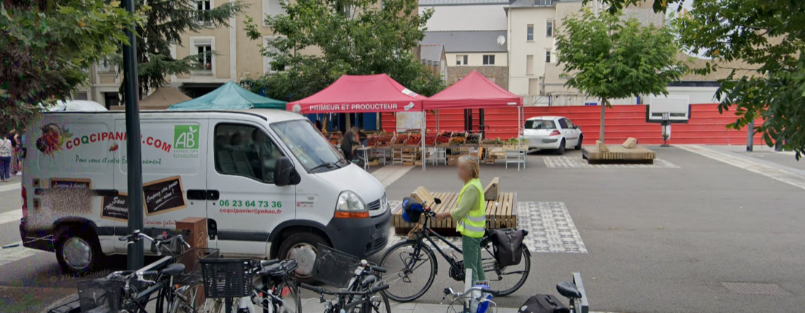
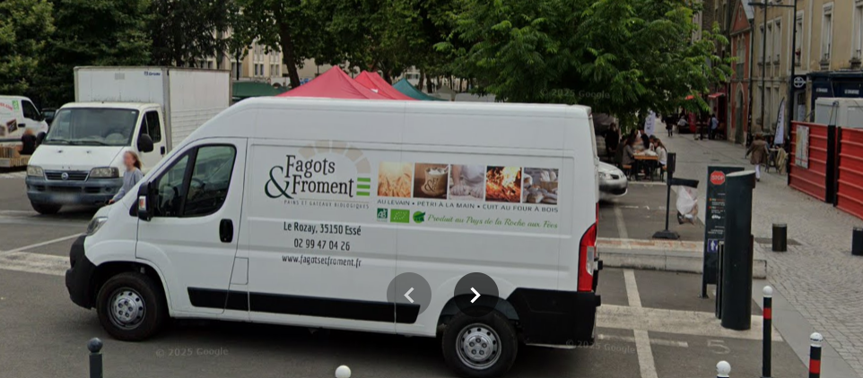
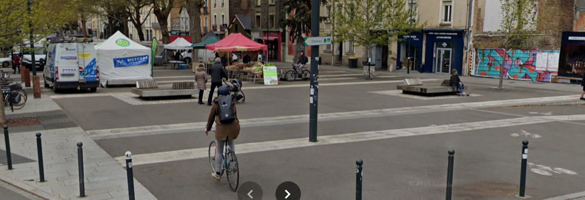

# Un stand pas très standard
> 281
> hard
> 
> RaptorJésus
> 
> Un ami chercheur vous contacte : "En allant à un colloque il y a six ou sept ans, je suis tombé sur un super stand de marché, mais impossible de me rappeler ce qu'ils y vendaient ! Je t'envoie quelques photos avec des flèches pour te montrer son emplacement approximatif... Si ça peut t'aider, c'était le stand situé le plus au nord-est de tous." Arriverez-vous à retrouver la catégorie d'activité du stand auquel pense votre ami ? 
> 
> Format : 404CTF{apiculture}

Deux photos sont fournies.

Dans la première, on peut lire "cabane" sur un restaurant. Dans la deuxième, il y a marqué "CASA CERA" à l'endroit de la flèche.

Casa Cera est situé à Rennes (2 ter Mail François Mitterrand, 35000 Rennes). Sur Google Maps les images actuelles correspondent bien aux deux photos.

Avec street view, on regarde les photos qui ont été prises en 2019/2020 (il y a six ou sept ans). On retrouve des stands de marché sur trois points de vue, à des dates différentes.

https://maps.app.goo.gl/b9UtU3waL6p17X45A

Dans tous les cas, le stand le plus au nord-est est le "primeur et producteur".

La catégorie d'activité du stand est le maraîchage.

Flag : ``404CTF{maraichage}``